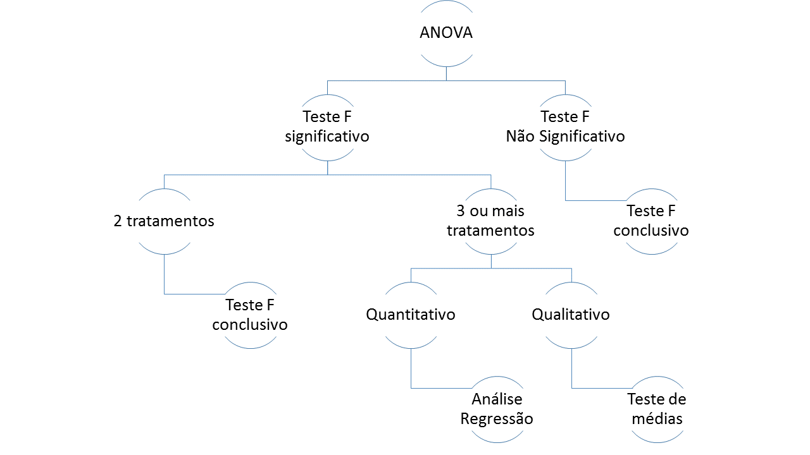

--- 
title: "Computação em R: Análise experimental"
author: "Eric Bastos Gorgens, Marcio Leles Romarco de Oliveira"
date: "`r Sys.Date()`"
site: bookdown::bookdown_site
---

# Introdução


Bem-vindo ao mundo do R. O R não é só um software, nem se resume a uma linguagem. O R é um estilo de pesquisar, estudar e ensinar. Através de seus códigos e scripts você entrará num mundo sem limites, aberto à experimentação e à troca de experiência. Um mundo em que não existe apenas uma forma de se chegar à resposta correta, mas sim uma gama de alternativas! Você deve estar se perguntando: porque começar a trabalhar com o R? A resposta passa por algumas perspectivas interessantes.

R é gratuito. Por se tratar de um projeto de código aberto, você pode usar o R sem nenhum custo adicional: ou seja sem necessidade de pagar por inscrições, assinaturas, licenças ou limitações. Sendo o R aberto, você pode ter acesso ao código e ajustá-lo às suas necessidades (para mais detalhes veja: GNU General Public License version 2). Centenas de experts ao redor do mundo fazem exatamente isto e suas contribuições beneficiam milhares de usuários do R.

R é uma linguagem. No R, você realiza uma análise escrevendo funções e scripts; e não clicando em botões na tela. Isto pode assustar e parecer difícil, mas na verdade, a linguagem R é uma linguagem simples de aprender e muito natural para análise de dados. Aprender uma linguagem tem vários benefícios. Por se tratar de uma linguagem interativa, o R promove uma oportunidade de experimentar e explorar os dados de forma profunda e detalhada. Um script documenta passo a passo da análise, do acesso aos dados até os resultados das análises, podendo ser executados a qualquer momento, por qualquer pessoa.
Gráficos e visualização de dados. Faz parte das premissas de criações do R, a certeza de que a visualização dos dados através de gráficos é uma parte essencial de qualquer análise dos dados. Como resultado, o R oferece excelentes ferramentas para criação de gráficos, de barras até multi-painéis. Os recursos gráficos do R é influenciado pelos principais pensadores da área de visualização de dados como Bill Cleveland e Edward Tufte. Gráficos do R podem ser vistos em respeitadas publicações mundiais como The New York Times, The Economist, e o blog FlowingData.

Pacote flexível de análises estatísticas. Você irá encontrar no R um conjunto de ferramentas prontamente disponíveis, desde o acesso à vários tipos de dados, até recursos para manipulação de dados, passando pelos modelos estatísticos tradicionais e modernos. Todos os recursos estão disponíveis numa plataforma orientada a objeto que torna fácil a programação e construção de relatórios.

Acesso às poderosas e avançadas técnicas estatísticas. Os principais acadêmicos e pesquisadores do mundo utilizam o R para desenvolver as novidades nas áreas de estatística, máquinas de aprendizado e modelagem. Você pode encontrar extensões para o R contendo desenvolvimento de ponta na área econômica, genética e muitos outros campos. Atualmente são mais de 2000 pacotes que incrementam o seu R disponíveis para download.

Uma brilhante e vibrante comunidade. Com centenas de contribuidores e mais de dois milhões de usuários ao redor do mundo, se você tiver uma dúvida sobre o R, as chances de alguém já ter esbarrada com este problema é muito grande. A comunidade é gigante e participativa. A mediana de tempo que uma pergunta leva para ser respondida no StackOverflow (maior comunidade de programadores do mundo) é de 0.0147 dias, o que equivale a 21 minutos.

O R é multiplataforma rodando em Linux, Mac ou Windows. Ainda é possível configurar para rodar diretamente da nuvem. O R valoriza o que a empresa tem de mais valioso: você!

Possibilidades infinitas. Com o R você não está limitado por uma sequência pré-definida de rotinas. Você pode usar todo o portfólio de códigos e soluções disponíveis na comunidade ou mesmo criar suas próprias funções. É possível inclusive combinar o R com outros recursos como uma base de dados MySQL, ou um Apache web-server, ou ainda com o Google Maps API. Qual a sua ideia?

<!--chapter:end:index.Rmd-->

# Delineamentos experimentais

Delineamento experimental define a organização das unidades experimentais em função da pergunta científica que se deseja responder. Com base no delineamento escolhido, regras precisam ser seguidas, especialmente relacionados à maneira que os tratamentos são distribuídos nas unidades experimentais.

A unidade experimental é o objeto que identifica um sistema de interesse de uma pesquisa e representa uma unidade da população. É sobre a unidade experimental que os tratamento serão aplicados e avaliados.

Os tratamentos são variáveis manipuladas e controladas pelo pesquisador. Desta forma, qualquer outra influência tem que ocorrer ao acaso, e por isto, as unidades experimentais devem ser o homogêneas e o tratamento deve ser a ela atribuída de forma aleatória.

Outro ponto importante num delineamento experimental, é o número de repetições. Desta forma, deve haver unidades experimentais suficientes para que os tratamentos sejam aplicados e repetidos. Quanto maior o número de repetições, menor o intervalo de confiança e, portanto, mais precisa as inferências estatísticas. Existem metodologias específicas para a determinação do número ideal de repetições, mas na prática, adotam-se trabalhos anteriores como referência, ou mesmo a disponibilidade de material acaba definindo o número de repetições.

## ANOVA

A Análise de Variância, ou simplesmente ANOVA, é uma análise estatística para determinar a contribuição de diferentes fatores na variância total de um experimento. 

O método foi desenvolvido em 1925 por Ronald Fisher para experimentos balanceados, ou seja, experimentos com o mesmo número de repetições em cada tratamento. No entanto, correções foram desenvolvidas para tratar experimentos desbalanceados, como será observado mais adiante. Assim, podemos definir Análise de Variância (ANOVA) como uma técnica que decompõe a variância total e seus graus de liberdade em partes atribuídas a fatores  controlados (tratamento) e a uma outra parte associada a uma causa não controlada, também chamada de resíduo.

### Partição da variação

Suponha que estamos analisando o efeito de três materiais genéticos através de um experimento inteiramente casualizado. Cada tratamento foi formado por seis repetições, cada uma contendo 36 plantas, tratando-se assim de um experimento balanceado. Resumindo:

- Um fator com 3 tratamentos (`i` variando de 1 a 3)
- 6 repetições por tratamento (`j` variando de 1 a 6)
- 18 unidades experimentais presentes no experimento

A variável de interesse é a altura. Portanto, deseja observar se os tratamentos influenciam a altura das plantas. A média das alturas das árvores de cada uma das repetições é:

```{r echo = FALSE, results = 'asis'}
library(knitr)
anova.intro = read.csv('./data/anova_intro.csv')
kable(anova.intro, caption = "Dados de exemplo.")
```

Para analisar o experimento, será necessario obter a média e a soma para cada tratamento:

```{r echo = FALSE, results = 'asis'}
library(knitr)
tratamentos = read.csv('./data/anova_sumRep.csv')
kable(tratamentos, caption = "Média e soma de cada tratamento.")
```

E também a soma e média global:

```{r echo = FALSE, results = 'asis'}
library(knitr)
totais = read.csv('./data/anova_sumTotal.csv')
kable(totais, caption = "Média e soma total.")
```

Todas as somas - `sum()` e médias - `mean()` que faltam nas tabelas acimas serão computadas uma a uma por meio de linhas de comando no R. Desta forma, aproveite para relembrar um pouco da sintaxe, bem como dos operadores matemáticos:

1. Entrar com os vetores correspondentes a cada tratamento com os valore de suas respectivas repetições.

```{r}
matGen1 = c(21, 20, 20, 17, 18, 17)
matGen2 = c(19, 19, 17, 13, 16, 14)
matGen3 = c(18, 18, 15, 13, 13, 13)
```

2. Calcular a soma das repetições do tratamento 1.

```{r}
s1 = sum(matGen1)
print (paste("Soma MATGEN1 = ", s1, sep = " "))
```

3. Calcular a média das repetições do tratamento 1.

```{r}
m1 = mean(matGen1)
print (paste("Media MATGEN1 = ", m1, sep = " "))
```

4. Calcular a soma das repetições do tratamento 2.

```{r}
s2 = sum(matGen2)
print (paste("Soma MATGEN2 = ", s2, sep = " "))
```

5. Calcular a média das repetições do tratamento 2.

```{r}
m2 = mean(matGen2)
print (paste("Media MATGEN1 = ", m2, sep = " "))
```

6. Calcular a soma das repetições do tratamento 3.

```{r}
s3 = sum(matGen3)
print (paste("Soma MATGEN3 = ", s3, sep = " "))
```

7. Calcular a média das repetições do tratamento 3.

```{r}
m3 = mean(matGen3)
print (paste("Media MATGEN3 = ", m3, sep = " "))
```

8. Calcular a soma de todas as repetições, dos três tratamentos.

```{r}
somaTotal = sum(c(matGen1, matGen2, matGen3))
print (paste("Soma total = ", somaTotal, sep = " "))
```


9. Calcular a média geral de todos os tratamentos e repetições.

```{r}
mediaGeral = mean(c(matGen1, matGen2, matGen3))
print (paste("Media geral = ", mediaGeral, sep = " "))
```

A partir dos resultados obtidos nas etapas anteriores, as tabelas ficarão assim:

```{r echo = FALSE, results = 'asis'}
library(knitr)
tratamentos = read.csv('./data/anova_sumRep2.csv')
kable(tratamentos, caption = "Média e soma de cada tratamento calculado.")
```

```{r echo = FALSE, results = 'asis'}
library(knitr)
totais = read.csv('./data/anova_sumTotal2.csv')
kable(totais, caption = "Média e soma total calculado.")
```

#### Soma de quadrados total

O próximo passo é analisar a diferença de cada uma das 18 observações (3 tratamentos * 6 repetições cada) em relação à média geral:

$$desvio = x_{ij} - \bar{x}$$

em que `j` indica a repetição variando de 1 a 6 e `i` indica o tratamento variando de 1 a 3.

No R, esta operação fica fácil, pois é possível fazer de uma única vez a subtração dos elementos de um vetor pela média geral:

```{r}
desvio1 = matGen1 - mediaGeral
desvio1

desvio2 = matGen2 - mediaGeral
desvio2

desvio3 = matGen3 - mediaGeral
desvio3
```

Tabulando os desvios calculados acima, tem-se uma tabela da seguinte forma:

```{r echo = FALSE, results = 'asis'}
library(knitr)
desvios = read.csv('./data/anova_desvio.csv')
kable(desvios, caption = "Desvio da observação para e média geral.")
```

Elevando cada um dos desvios ao quadrado e somando, obtem-se a soma de quadrados total (SQTotal). Esta soma de quadrados é a variação total dos dados.

$$SQTotal = \sum (x_{ij} - \bar{x})^2$$

em que `i` indica a repetição variando de 1 a 6 e `j` indica o tratamento variando de 1 a 3. A soma de quadrados total pode ser obtida com:

```{r}
sqTotal = sum(desvio1^2, desvio2^2, desvio3^2)
print(sqTotal)
```

#### Soma de quadrados dos tratamentos

A soma de quadrados dos tratamentos, ou a soma de quadrados entre os tratamentos, pode ser calculada pela diferença entre a média de cada tratamento em relação à média geral. 

$$desvio_{i} = \bar{x}_{i} - \bar{x}$$

em que `j` indica a repetição variando de 1 a 6 e `i` indica o tratamento variando de 1 a 3. Para isto, o valor de cada repetição é substituído pela média do seu tratamento. Isto é, através da fórmula `rep`, cria-se um vetor com a média do material genético repetida 6 vezes. Com esse procedimento, elimina-se o efeito do erro, já que cada tratamento será representado `j` vezes pelo valor da sua média. Finalmente, cada repetição é subtraída pela média geral.

```{r}
desvioTrat1 = rep(mean(matGen1), 6) - mediaGeral
desvioTrat1

desvioTrat2 = rep(mean(matGen2), 6) - mediaGeral
desvioTrat2

desvioTrat3 = rep(mean(matGen3), 6) - mediaGeral
desvioTrat3
```


Trazendo os resultados do R para uma tabela de desvios tem-se:

```{r echo = FALSE, results = 'asis'}
library(knitr)
desvios2 = read.csv('./data/anova_desvio2.csv')
kable(desvios2, caption = "Desvio entre a média do tratamento e média geral.")
```

Os desvios são então elevados ao quadrado e somados, resultando na soma de quadrados dos tratamentos (SQTrat):

```{r}
sqTrat = sum(desvioTrat1^2, desvioTrat2^2, desvioTrat3^2)
print(sqTrat)
```

#### Soma de quadrados dos resíduos

A soma de quadrados dos resíduos (SQRes) é também conhecida como soma de quadrados dentro do tratamento. Primeiro, calcula-se o desvio entre a cada uma das repetições e a média do respectivo tratamento:

$$desvio = x_{ij} - \bar{x}_{i}$$
No R, podemos calcular da seguinte forma:

```{r}
desvioRes1 = matGen1 - mean(matGen1)
desvioRes1
desvioRes2 = matGen2 - mean(matGen2)
desvioRes2
desvioRes3 = matGen3 - mean(matGen3)
desvioRes3
```

Trazendo os resultados do R para uma tabela de desvios tem-se:

```{r echo = FALSE, results = 'asis'}
library(knitr)
desvios3 = read.csv('./data/anova_desvio3.csv')
kable(desvios3, caption = "Desvio da observação para e média do tratamento")
```

Elevando cada desvio ao quadrado e somando-os, calcula-se a soma de quadrados dos resíduos:

```{r}
sqRes = sum(desvioRes1^2, desvioRes2^2, desvioRes3^2)
print(sqRes)
```

#### Quadrado médio

O próximo passo é montar o quadro da ANOVA e determinar os quadrados médios:

```{r echo = FALSE, results = 'asis'}
library(knitr)
formulas = read.csv('./data/anova_qm.csv')
kable(formulas, caption = "Fórmulas para o caluclo do quandrado médio.")
```

Tanto a soma de quadrados, como os graus de liberdade são aditivos. Isto é, obtendo dois termos do quadro de variância, o terceiro pode ser derivado. 

Na prática, calcula-se a soma de quadrados total e a soma de quadrados do tratamento.  Por diferença, obtém-se a soma de quadrados dos resíduos. O mesmo raciocínio vale para os graus de liberdade.

O quadrado médio, nada mais é que uma variância. Por isso, divide-se a soma de quadrados pelos graus de liberdade. Os quadrados médios são calculados da seguinte forma:

1. Quadrado médio dos tratamentos

```{r}
qmTrat = sqTrat / (3 - 1)
print(qmTrat)
```

2. Quadrado médio do residuo

```{r}
qmRes = sqRes / (3 * (6 - 1))
print(qmRes)
```


#### Teste F

Assim, o objetivo final da ANOVA é comparar a variância dos tratamentos relativa à variância dos resíduos. O valor da razão entre estas duas variâncias segue a distribuição F, recorrendo-se então à uma tabela de distribuição amostral da razão F para avaliar a significância do teste.

```{r}
Fcalc = qmTrat / qmRes
print(Fcalc)
```

O quadro final da ANOVA será:

```{r echo = FALSE, results = 'asis'}
library(knitr)
anova.intro = read.csv('./data/anova_final.csv')
kable(anova.intro, caption = "Quandro final da ANOVA")
```

A hipótese nula é de que as variâncias dos tratamentos é igual à variância populacional, ou variância dos resíduos. Um teste não significativo aceita-se a hipótese nula. Já um teste significativo rejeita-se a hipótese nula.

```{r}
Ftabelado = qf(0.95, 2, 15)
print(Ftabelado)
```

Neste exercício, o `Fcalc` é superior ao `Ftabelado`. Assim o teste F é significativo e a hipótese nula é rejeitada para um nível de significância de 95%. A variância dos tratamentos não pode ser considerada igual à variância da população. Na prática isto indica que existe um efeito significativo dos tratamentos.

Se o teste F é não significativo (`F calculado < F tabelado`), entende-se que os tratamentos não influenciaram as observações e a análise de seu experimento encerra-se aqui.

Por outro lado, o teste F significativo indica que pelo menos um dos tratamentos influenciou os dados observados. Se apenas dois tratamentos tiverem sido realizados, o teste F é conclusivo e as médias dos tratamentos podem ser comparadas diretamente. Se três ou mais tratamentos estiverem sendo comparados, o teste F é inconclusivo, uma vez que diz apenas que existe uma influência dos tratamentos, sem no entanto indicar qual deles é melhor ou pior. Assim uma pergunta surge: como os tratamentos se diferem uns dos outros?

Entram em cena os testes de médias ou a análise de regressão. Quando os tratamentos são qualitativos e significativos, o teste de médias irá dizer quais tratamentos são iguais e quais tratamentos são diferentes. Quando os tratamentos são quantitativos e significativos, utiliza-se a análise de regressão para definir o ponto ótimo. 

Para facilitar, a figura a seguir resume o que foi visto até agora por meio de uma árvore de decisão:



## Tipos de ANOVA

Existem pelo menos 3 formas para se calcular a soma de quadrados da ANOVA, que são conhecidos como soma de quadrados do TIPO I, TIPO II e TIPO III. Esta notação foi introduzida pelo software SAS, mas acabou sendo adotada pela comunidade para diferenciar entre as diferentes formas de se calcular a soma de quadrados para composição da ANOVA.

A recomendação de uso dos diferentes tipos de soma de quadrados leva a calorosas discussões entre estatísticos. De modo geral, o tipo I é o padrão usado para dados balanceados. O tipo II e tipo III são mais indicados para dados desbalanceados. Quando o experimento é balanceado, os três tipos de ANOVA apresentam resultados idênticos.

### Variações no cálculo da soma de quadrados

Partindo de um experimento que considere dois fatores A e B; sendo dois fatores principais e a interação AB, o modelo completo pode ser representado por `SQ(A, B, AB)`. Também podem ser considerados modelos parciais como `SQ(A, B)` que indica um modelo sem interação, ou como `SQ(B, AB)` que indica um modelo que não considera efeitos do fator A.

A influência de um determinado fator (ou interação) é testada examinando as diferenças entre os modelos. Por exemplo, para determinar a presença de interação entre os fatores, um teste F é conduzido comparando o modelo com interação `SQ(A, B, AB)` e o modelo sem interação `SQ(A, B)`.

### ANOVA Tipo I

A ANOVA tipo I testa primeiro o efeito de A, seguido do efeito de B dado que se conhece A, seguido pela interação dado que os efeitos principais já são conhecidos. Esta ordem natural (`A -> B -> AB`) é a razão desta ANOVA ser conhecida como soma de quadrados sequencial.

1. `SQ(A)` para o fator A.
2. `SQ(B | A)` para fator B.
3. `SQ(AB | B, A)` para interação AB.

### ANOVA Tipo II

Este tipo de ANOVA testa o efeito de um dos fatores principais dado que o outro já é conhecido. Assim, assume-se a não significância da interação. 

Sugere-se no entanto que se teste `SQ(AB | A, B)`. Se de fato a interação for não significativa, então o tipo II é estatisticamente mais poderoso que o tipo III. 

1. `SQ(A | B)` para o fator A.
2. `SQ(B | A)` para o fator B.

### ANOVA Tipo III

Este tipo de ANOVA só é válido quando a interação é significativa. No entanto, em muitos casos não se tem interesse em analisar os fatores principais quando a interação está presente, ou seja, na presença de interação, os efeitos principais deixam de ser interessantes isoladamente. 

1. `SQ(A | B, AB)` para o fator A.
2. `SQ(B | A, AB)` para o fator B.

Assim, na prática, só é necessário preocupar com dados desbalanceados quando a interação entre fontes de variação for considerada no modelo estatístico do experimento.

<!--chapter:end:02-delineamentos.Rmd-->

# Pressuposições e transformações

Duas são as pressuposições da ANOVA:

- Homogeneidade de variâncias
- Normalidade dos resíduos

Neste momento, não se preocupe com os testes estatísticos utilizados para a verificação dessas pressuposições. Até mesmo, porque as pressuposições precisam ser analisadas após a análise de variância ser realizada, já que a normalidade da variável não garante a normalidade dos resíduos.

No caso de uma das pressuposições não serem atendidas, os dados devem ser transformados, a análise refeita e as pressuposições novamente verificadas. Na sequência serao apresentadas as principais transformações usadas na área das ciências florestais e biológicas.

## Transformação Logarítmica

Esta transformação é indicada para variáveis contínuas e consiste em obter o `log` de cada uma das observações. É possível usar tanto o log base 10 quanto o log base **e**. Utilizar um ou outro não faz nenhuma diferença para o teste estatístico, pois a única diferença é a constante logarítmica.

Não deixe de registrar qual a base foi utilizada já que esta decisão influencia a interpretação do coeficiente angular e o coeficiente de inclinação da regressão num eventual desdobramento.

```{r}
a = 5.7
trans_a = log(a)
```

Para reverter a transformação logarítmica:

```{r}
exp(trans_a)
```

Lembre-se de que se os dados possuem zeros ou valores negativos, não se pode usar a transformação logarítmica. Uma saída é adicionar uma constante a cada número para torná-lo positivo e não zero. Se os dados forem contagem com presença de zero, a solução é adicionar 0,5 a cada observação.

Muitas variáveis biológicas tem distribuição log-normal. Desta forma, após a transformação logarítmica, os valores passam a ter distribuição normal. O produto de conjunto de fatores independentes é log-normal. Por exemplo, a altura de uma árvore é uma função de (nitrogênio x água x luz x pragas). Matematicamente esta função é uma log-normal.

## Transformação da Raiz quadrada

Esta transformação consiste na obtenção da raiz quadrada de cada uma das observações. Esta transformação é muito utilizada para variáveis de contagem. No entanto ela só pode ser utilizada para dados positivos. Em caso de número negativos, uma saída é adicionar uma constante a todas as observações eliminando assim as observações negativas. 

```{r}
b = 10
trans_b = sqrt(b)
```

Para reverter a transformação:

```{r}
trans_b^2
```

## Transformação do Arcoseno

Esta transformação consiste em calcular o arcoseno da raiz quadrada de cada uma das observações. O resultado é dado em radianos e não em graus, e pode variar de -π/2 a π/2. Os números para serem transformados pelo arcoseno precisam estar entre -1 e 1. Por isso, é comum utilizar esta transformação para proporções, cuja amplitude geralmente está entre 0 e 1

```{r}
c = 0.8
trans_c = asin(sqrt(c))
```

Para reverter a transformação:

```{r}
(sin(trans_c))^2
```

<!--chapter:end:03-pressuposicoes.Rmd-->

# ANOVA no R

Este capítulo começa com uma boa notícia. O R conta com diversos pacotes desenvolvidos que realizam toda a sequência de uma análise de variância, tanto para o caso balanceado, quanto para o caso desbalanceado. Ao longo deste livro serão utilizados dois pacotes:

- `ExpDes.pt`
- `easyanova`

Os pacotes no R são desenvolvidos e disponibilizados de forma oficial no repositório chamado de CRAN. Embora um pacote precise seguir determinadas regras mínimas para ser disponibilizado no repositório oficial, o estilo de cada desenvolvedor leva a diferenças significativas nas características e no funcionamento dos pacotes.

## Pacote ExpDes.pt

O pacote `ExpDes.pt` (e sua versão em inglês `ExpDes`) foi desenvolvido por uma equipe da Universidade de Alfenas (Unifal) composta por Eric Batista Ferreira, Pórtya Piscitelli Cavalcanti, Denismar Alves Nogueira e outros. Este pacote realiza a análise de diversos delineamentos experimentais e desdobramentos tanto de fatores qualitativos quanto de fatores quantitativos. Para instalar o `ExpDes.pt`:

```{r eval=FALSE}
install.packages("ExpDes.pt")
```

O pacote `ExpDes.pt` ao ser instalado trás diversas funções para analisar os seguintes delineamentos experimentais:

- DIC: delineamento inteiramente casualizado
- DBC: delineamento em blocos casualizados
- DQL: delineamento em quadrado latino
- Experimentos em esquema de fatorial duplo (em DIC e DBC)
- Experimentos em esquema de parcelas subdivididas (em DIC e DBC)
- Experimentos em esquema de fatorial duplo com um tratamento adicional (em DIC e DBC)
- Experimentos em esquema de fatorial triplo (em DIC e DBC) 
- Experimentos em esquema de fatorial triplo com um tratamento adicional (em DIC e DBC)

O pacote permite ainda o desdobramento de níveis quantitativos a partir de modelos de regressão até o terceiro grau. No caso de níveis qualitativos, o desdobramento ocorre por testes de comparação múltipla incluindo: 

- Teste de Tukey
- Teste de Student-Newman-Keuls (SNK)
- Teste de Scott-Knott
- Teste de Duncan
- Teste t (LSD)
- Teste t de Bonferroni (LSD protegido)
- Teste Bootstrap

Mesmo depois de instalados, os pacotes precisam ser ativados antes de serem utilizados. A ativação pode ser feita pelo comando:

```{r}
require(ExpDes.pt)
```

Uma vez ativado, as funções do pacote passam a estar disponíveis para o usuário. Para conhecer os parâmetros e o funcionamento da função, a página de ajuda pode ser consultada digitando no console `?` seguido do nome da função:

```{r eval=FALSE}
?dic
```

Toda função no R é composta por parâmetros obrigatórios e parâmetros opcionais. Esta indicação será obtida analisando a sintaxe da função, também disponível na página de ajuda. Como exemplo, consultando a página de ajuda da função `dic`, nota-se que a sintaxe básica da funçao é:

```{r eval=FALSE}
dic(trat, resp, quali = TRUE, mcomp = "tukey", sigT = 0.05, sigF = 0.05)
```

Pela sintaxe apresentada acima, dois parâmetros são obrigatórios: `trat` e `resp`. Estes parâmetros correspondem às colunas da nossa base de dados em que `trat` indica tratamento e `resp` indica variável resposta. Os demais parâmetros não são obrigatórios pois já estão pré-definidos. Por exemplo, o parâmetro `quali` está pré-definido como `TRUE`. Isto implica que os níveis do tratamento serão interpretados como qualitativos. Assim, se o experimento possuir tratamento com níveis quantitativos, como por exemplo dosagem de nutrientes, o parâmetro `quali` deverá ser definido como `FALSE`. Os demais parâmetros optativos indicam:

- `mcomp`: o teste de média que será aplicado caso seja necessário realizar o desdobramento dos tratamentos. O parâmetro vem pré-definido como Teste de Tukey (`tukey`).
- `sigT`: o nível de significância para o teste de médias. Pré-definido como 5% (`0,05`).
- `sigF`: o nível de significância para o teste F da análise de variância. Pré-definido como 5% (`0,05`).

O pacote `ExpDes.pt` só é capaz de computar a ANOVA do Tipo I, e é por isto que os experimentos desbalanceados não devem ser analisados por meio desse pacote.

## Pacote easyanova

O pacote `easyanova` foi desenvolvido pelo professor Emmanuel Arnhold, que leciona disciplinas de estatística aplicada à experimentação agropecuária em nível de graduação e pós-graduação na Universidade Federal de Goiás (UFG). O pacote `easyanova` pode ser utilizado para qualquer tipo de experimento - balanceado e desbalanceado - já que possui um mecanismo que define o tipo de ANOVA com base na estrutura dos dados apresentados. Outra vantagem é que este pacote realiza tanto o teste de normalidade quanto o teste de homogeneidade de variâncias. Para instalar o `easyanova`:

```{r eval=FALSE}
install.packages("easyanova")
```

Estando o pacote instalado, a sua ativação pode ser feita através da função `require()`:

```{r}
require(easyanova)
```

Diferentemente do pacote `ExpDes.pt`, o easyanova possui apenas duas funções básicas para análise de experimentos:

- `ea1()`
- `ea2()`

A definição do delineamento e/ou do esquema é feito através de um parâmetro dentro destas duas funções. Assim, através da definição do parâmetro `design`, a função `ea1()` é capaz de analisar os seguintes delineamentos:

1.	inteiramente casualizado
2.	blocos casualizados
3.	quadrado latino
4.	several latin squares
5.	análise de covariância (dic)
6.	análise de covariância (dbc)
7.	blocos incompletos tipo I e II
8.	blocos incompletos tipo III ou blocos aumentados
9.	blocos incompletos tipo III em experimentos com animais
10.	lattice (intra-blocos)
11.	lattice (inter-blocos)
12.	switchback
13.	switchback em blocos
14.	teste Kruskal-Wallis
15.	teste Friedman

Já a função `ea2()` é capaz, através da definição do parâmetro `design`, de analisar os seguintes delineamentos:

1.	fatorial duplo inteiramente casualizado
2.	fatorial duplo em blocos casualizados
3.	fatorial duplo em quadrados latinos
4.	parcela subdividida inteiramente casualizado
5.	parcela subdividida em blocos casualizados
6.	parcela dividida em quadrados latinos
7.	fatorial triplo inteiramente casualizado
8.	fatorial triplo em blocos casualizados
9.	fatorial duplo em parcela subdividida (DIC)
10.	fatorial duplo em parcela subdividida (DBC) 
11.	blocos hierárquicos
12.	quadrado latino com linhas hierárquicas
13.	quadrado latino com linhas e colunas hierárquicas

Uma diferença importante entre os pacotes `ExpDes.pt` e `easyanova` é a forma de apresentação dos dados. No `ExpDes.pt` apresenta-se os vetores correspondentes às fontes de variação isoladamente: um vetor com os tratamentos (ex: `dic2$Tratamento`), depois um vetor com a variável de interesse (ex: `dic2$Altura`).

Já no pacote `easyanova`, as fontes de variação devem ser apresentadas em forma de dataframe contendo exatamente as fontes de variação, variável de interesse e a repetição. Para cada um dos delineamentos suportados, o pacote `easyanova` apresenta uma base exemplo que pode ser verificada via página de ajuda: `?ea1` ou `?ea2`.

Como exemplo, o experimento em delineamento inteiramente casualizado seria analisado através da função `ea1()` cuja sintaxe básica é:

```{r eval=FALSE}
ea2(data, design = 1, alpha = 0.05, list = FALSE, p.adjust=1, plot=2)
```

O parâmetro `design` vem pré-definido como 1. Assim, fique atento em defini-lo de acordo com o delineamento correto do seu experimento.

Embora pela sintaxe acima, o único parâmetro obrigatório seja a base de dados - `data`, fica evidente que o `design` também precisa ser corretamente informado, de acordo com o delineamento do experimento a ser analisado. Um outro parâmetro opcional que vale a pena ser mencionado aqui é o `plot`. Três opções podem ser utilizadas para este parâmetro:

`1` - indicando gráfico boxplot dos resíduos.

`2` - indicando gráfico de dispersão dos resíduos padronizados em função dos dados sequenciais.

`3` - indicando gráfico de dispersão dos resíduos padronizados em função dos quantis teóricos.

As funções `ea1()` e `ea2()` retornam uma lista contendo a análise de variância, os desdobramentos e os testes de comparações múltiplas. O conteúdo da lista serão apresentados durante os exemplos dos capítulos subsequentes.

Lembre-se! Delineamentos balanceados serão analisados no pacote `ExpDes.pt` (ou sua versão com saídas em inglês `ExpDes`). Já os delineamentos desbalanceados serão analisados com o pacote `easyanova`.

<!--chapter:end:04-anova.Rmd-->

# Investigando os dados

O primeiro desejo ao receber os dados é partir para a análise estatística. Mas espere! Antes de partir para uma análise de variância e teste de médias, explore os dados através dos diferentes pacotes gráficos disponíveis no R. Neste livro serão apresentados dois tipos de gráficos disponíveis no pacote básico:

- `plot`
- `boxplot`

Para quem busca opções avançadas para construção de gráficos sugerem-se os pacotes:

- `lattice`: http://www.statmethods.net/advgraphs/trellis.html
- `ggplot2`: http://docs.ggplot2.org/current/

## Plot: Gráfico de dispersão

A função `plot()` é indicada para analisar duas variáveis quantitativas, já que uma assumirá o eixo x e outra o eixo y, sendo ambos os eixos numéricos e contínuos. Para exemplificar o uso das funções gráficas, será utilizado dados de um experimento sobre o aparecimento de brotos em função do mês em que a poda é realizada. Deseja-se encontrar em qual mês que a poda deve ser realizada visando minimizar o número de brotos.

```{r}
exp.grafico = read.csv("./data/Exemplo para Graficos.csv", sep = ",", dec = ".")
```

```{r echo = FALSE, results = 'asis'}
kable(exp.grafico, caption = "Dados de delineamento inteiramente casualizado")
```

```{r}
plot(data = exp.grafico, Brotos ~ MesPoda, 
     xlab = "Mes da poda", 
     ylab = "Numero de brotos")
```

A interpretação de um gráfico de dispersão é bastante intuitiva e direta. Em geral, no eixo X (horizontal) coloca-se a variável que espera-se influenciar de alguma maneira a variável que está no eixo Y (vertical). Dessa maneira, analisa-se o quanto a variável do eixo X está influenciando a variável do eixo Y. 

No exemplo apresentado acima, a variável mês de poda influencia positivamente o número de brotos. Uma vez que quanto maior o mês de poda, maior é o número de brotos. Neste caso, observa-se uma relação diretamente proporcional.

## Boxplot: Gráfico de caixas

A função `boxplot()` é indicada para analisar uma variável categórica e outra variável contínua. Situação ideal, por exemplo, para verificar a influência de tratamentos qualitativos sobre uma variável de interesse. Ou ainda, avaliar o efeito do bloco sobre a variável de interesse.

```{r}
exp.grafico = read.csv("./data/Exemplo para Graficos.csv", sep = ",", dec = ".")
boxplot(data = exp.grafico, Brotos ~ Bloco, 
        xlab = "Bloco", 
        ylab = "Numero de brotos")
```

A interpretação do boxplot pode parecer complicada, já que este gráfico apresenta uma série de informações estatísticas em um único gráfico. Mas é justamente esta característica que o torna tão utilizado e tão importante.

A estrutura clássica do boxplot apresenta uma linha horizontal, dentro de uma caixa, sobreposta a uma linha vertical (do inglês *whisker*, também conhecida como bigode).

A linha horizontal no interior da caixa indica a mediana, ou o segundo quartil. Os limites da caixa indicam o primeiro e o terceiro quartil. Os fios do bigode (ou *whiskers*) indicam o máximo e o mínimo, excluindo *outliers*. A função boxplot assume como outlier dados que estão acima ou abaixo de 1.5 vezes a distância inter-quartil. Estes pontos considerados *outlier* serão marcados pontualmente no gráfico se estiverem presentes. No exemplo que apresentado acima, não houve a presença de *outliers*.

Lembre-se! O gráfico criado com a função `boxplot()` não remove os *outliers*, apenas exibe no gráfico. Assim, cabe a você a decisão de removê-los ou não.

<!--chapter:end:05-investigando.Rmd-->

# Delineamento inteiramente casualizado

Este é sem dúvida o caso mais simples dos delineamentos experimentais. Aqui, o fenômeno de estudo se resume a apenas duas fontes de variação: uma fonte de variação conhecida, determinada pelo tratamento e uma fonte de variação desconhecida, determinada pelo resíduo.

## Recapitulando

A análise começa pela determinação das somas de quadrados total, que é formada pela soma de quadrados do tratamento e pela soma de quadrados do resíduo. Uma vez obtidas as somas de quadrados, calculam-se os quadrados médios e o valor da estatística F. Se F calculado for superior ao F tabelado, assume-se que existe um efeito devido aos tratamentos, ao passo que se F calculado for inferior ao F tabelado, não há evidências suficientes para rejeitar a hipótese nula, aceitando-se a hipótese de que não existe efeito dos tratamentos.

Sendo o efeito dos tratamentos significativo, realiza-se o desdobramento por meio de um teste de médias, se os tratamentos forem qualitativos, ou por meio de uma análise de regressão se os tratamentos forem quantitativos.

## O caso balanceado

Para exemplificar o caso balanceado, será analisado um estudo sobre a influência de três diferentes tipos de substrato no crescimento em altura de mudas. Cada tipo de substrato foi utilizado na germinação de 10 plantas. 90 dias após o semeio, as alturas das plântulas foram medidas e registradas numa planilha eletrônica. Os dados podem ser assim resumidos:

- Tratamento: 3 substratos
- 10 repetições
- Variável de interesse: altura

Abaixo seguem as medições de altura tabuladas. Embora o R seja compatível com diversas extensões de planilhas eletrônicas, serão utilizados ao longo do livro arquivos em extensão `.csv`.

```{r echo = FALSE, results = 'asis'}
dic1 = read.csv('./data/Experimento DIC 1.csv')
kable(dic1, caption = "Dados de delineamento inteiramente casualizado")
```

O primeiro passo é importar o arquivo csv contendo o experimento para dentro do R. Esta tarefa pode ser realizada através do seguinte comando:

```{r}
dic1 = read.csv("./data/Experimento DIC 1.csv")
```

Lembre-se que de acordo com a formatação regional do seu computador pode ser necessário informar o separador de coluna e/ou separador decimal. Veja alguns exemplos de sintaxe logo em sequência.

1. Para o caso de separador decimal `.` e separador de coluna `,`:
```{r eval=FALSE}
dic1 = read.csv("Experimento DIC 1.csv", sep = ",", dec = ".")
```

2. Para o caso de separador decimal `,` e separador de coluna `;`:

```{r eval=FALSE}
dic1 = read.csv("Experimento DIC 1.csv", sep = ";", dec = ",")
```

Com a importação, cria-se um objeto chamado `dic1`, contendo os dados do experimento num formato de `dataframe`. 

Antes de partir para a análise, é fundamental explorar os dados de forma gráfica para conhecer melhor as relações e antecipar o resultado da análise estatística. A construção do gráfico ajuda na compreensão do fenômeno estudado e na validação da análise estatística escolhida. Por se tratar de um experimento com o tratamento formado por níveis qualitativos, recomenda-se o uso do `boxplot()`.

```{r}
boxplot(data = dic1, altura ~ tratamento)
```

Pelo gráfico obtido, é razoável esperar que não haja diferenças significativas entre os tratamentos (3 substratos), pois existe uma grande sobreposição entre os interquartis dos substratos. Assim, espera-se que a análise estatística do experimento corrobore a conclusão empírica baseada no interpretação do gráfico.

Com a função `dic()` do pacote `ExpDes.pt` será possível realizar toda a análise de um experimento de delineamento inteiramente casualizado, inclusive o desdobramento caso o teste F seja significativo e o tratamento tenha três ou mais níveis.

Lembre-se que o pacote `ExpDes.pt` não faz parte da instalação padrão do R, e precisa ser adicionado à parte. A sintaxe básica da função `dic()` é:

```{r eval=FALSE}
dic(trat, resp, quali = TRUE, mcomp = "tukey", sigT = 0.05, sigF = 0.05)

```

Neste experimento, não será necessário alterar nenhum parâmetro opcional, sendo então o comando construído da seguinte maneira:

```{r}
require(ExpDes.pt)
dic(dic1$tratamento, dic1$altura)
```

A primeira parte da análise é o quadro da variância que apresenta as fontes de variação com seus respectivos graus de liberdade, somas de quadrado e quadrados médio. Neste quadro também é apresentado o resultado do F calculado, que é a razão do quadrado médio do resíduo com o quadrado médio do tratamento. 

No capítulo sobre a análise de variância, o quadro da ANOVA terminava com o F calculado, sendo seguido pela análise de uma tabela da estatística F para comparar o valor do F calculado com o valor de F tabelado. Nos softwares, não é necessário recorrer à tabela F, já que o *p-valor* oferece uma interpretação direta da significância.

O *p-valor* do experimento foi 0,079121, o que equivale à um grau de significância de 7,9%. Sendo o nível de significância do experimento de 5%, o *p-valor* ficou acima da tolerância, indicando que o experimento não é significativo para um nível de 5%. Obviamente, também não é significativo para um nível de 1%.

Logo abaixo do quadro da ANOVA, é apresentado o coeficiente de variação do experimento (CV): 47,83%. O CV é utilizado para medir a precisão do experimento, representado pelo o desvio-padrão expresso como porcentagem da média. A interpretação do CV é muito subjetiva e varia muito entre as áreas da ciência. Na área das ciências agrárias, convencionou-se que valores acima de 30% são considerados excessivos.

Outra informação importante antes de aceitar o resultado da ANOVA, é verificar se os resíduos apresentam normalidade. Esta é uma pressuposição importante, uma vez que valida a escolha do modelo teórico do DIC para explicar o fenômeno:

$$Y = \bar{X} + TRAT + Erro$$

A não normalidade coloca em xeque o modelo teórico escolhido. Sendo então indicado a transformação dos dados e novo processamento da análise. A pressuposição deve então ser novamente verificada. Obtendo normalidade, os resultados obtidos com a variável transformada podem ser utilizados. Caso contrário, recomenda-se o uso de testes não paramétricos.

Neste exemplo, o teste de normalidade foi não significativo (*p-valor* = 0,06) e portanto não há evidências para rejeitar a hipótese de normalidade dos resíduos.

A última parte da saída apresenta o resultado do desdobramento caso o teste F seja significativo. Neste experimento, os tratamentos não são significativos e portanto, apresenta-se apenas a média de cada tratamento.

## Outro caso balanceado

Neste exemplo, segue outro experimento em delineamento inteiramente casualizado, em que se avalia a resposta no desenvolvimento em altura das plantas de quatro níveis de um nutriente. Cada nível de nutriente foi repetido 6 vezes. Assim o experimento pode ser resumido como:

- Tratamento: 4 dosagens de um nutriente
- 6 repetições
- Variável de interesse: altura

```{r echo = FALSE, results = 'asis'}
dic2 = read.csv('./data/Experimento DIC 2.csv')
kable(dic2, caption = "Dados de outro delineamento inteiramente casualizado")
```

O primeiro passo é importar o arquivo csv contendo os resultados do experimento para dentro do R. Esta tarefa pode ser realizada através do seguinte comando:

```{r}
dic2 = read.csv("./data/Experimento DIC 2.csv")
```


Antes de chamar a análise estatística, recomenda-se explorar os dados graficamente. Por se tratar de um experimento de níveis quantitativos, o gráfico de dispersão é mais adequado:

```{r}
plot(data = dic2, altura ~ tratamento)
```

O gráfico indica que a dosagem de 50 apresenta um desenvolvimento em altura superior às demais dosagens. Outro ponto que fica claro com o gráfico, é que o tratamento tem um efeito quadrático sobre a altura. Por se tratar de um caso balanceado, a análise estatística pode ser realizada com a função `dic()` do pacote `ExpDes.pt`:

```{r}
require(ExpDes.pt)
dic(dic2$tratamento, dic2$altura, quali = FALSE)

```

Note que o comando utilizado é muito semelhante ao exemplo anterior, com apenas uma diferença no parâmetro `quali`. Neste experimento, utiliza-se o parâmetro como `FALSE` por se tratar de um experimento com tratamento quantitativo.

O modelo estatístico pode ser aceito uma vez que não há evidências para rejeitar a hipótese de normalidade dos resíduos. Desta forma, pode-se dar sequência na interpretação dos resultados da análise do experimento.

Os tratamentos podem ser considerados significativos já que seu *p-valor* é inferior a 1%. O desdobramento do tratamento é realizado através de um teste de regressão, já que os níveis do tratamento são quantitativos.

Como padrão, a função `dic()` desdobra os níveis do tratamento em três modelos: linear, quadrático e cúbico. Pelo gráfico de dispersão criado na fase de exploração dos dados, espera-se que o modelo quadrático seja o mais adequado para representação do experimento. 

Com base nos resultados do desdobramento, nota-se que o modelo linear e cúbico são claramente inadequados. No caso do modelo linear, o *p-valor* indica não significância do efeito linear, reforçado pelo coeficiente de determinação próximo a zero. O efeito cúbico, também foi inadequado pela falta de graus de liberdade. Como experimento analisado conta apenas com 4 níveis no tratamento, não sobra graus de liberdade para o resíduo. O modelo quadrático, por sua vez, apresenta um efeito significativo frente à análise de variância, tanto do efeito quanto dos coeficientes. O coeficiente de determinação de 60,36% também indica um ajuste satisfatório.

A dose ótima do nutriente pode ser encontrada através do ponto de máximo do modelo quadrático considerando o intervalo dos níveis analisados, isto é, de 0 a 75. Cuidado com extrapolações, uma vez que o experimento não contempla doses fora do intervalo analisado.

## O caso desbalanceado

Experimentos desbalanceados são muito comuns na área das ciências agrárias. Isto ocorre principalmente devido à perda unidades experimentais devido à contaminação, morte ou eventos não previstos. Veja o experimento em delineamento inteiramente casualizado, em que se avalia a resposta no desenvolvimento em altura das plantas de quatro níveis de um nutriente. Cada nível de nutriente foi repetido 6 vezes. 

- Tratamento: 4 dosagens de um nutriente
- 6 repetições
- Variável de interesse: altura

No entanto, perceba que duas medições foram perdidas por morte das plantas:

- dose 0 repetição 4
- dose 75 repetição 2

```{r echo = FALSE, results = 'asis'}
dic3 = read.csv('./data/Experimento DIC 3.csv')
kable(dic3, caption = "Dados de outro delineamento inteiramente casualizado, porém neste caso desbalanceado")
```

O primeiro passo é importar o arquivo contendo os resultados do experimento para dentro do R. Esta tarefa pode ser realizada através do seguinte comando:

```{r}
dic3 = read.csv("./data/Experimento DIC 3.csv")
```

Antes de chamar a análise estatística, recomenda-se explorar os dados graficamente. Por se tratar de um tratamento de níveis quantitativos, o gráfico de dispersão é mais adequado:

```{r}
plot(data = dic3, altura ~ tratamento)
```

Mesmo se tratando de um experimento desbalanceado, por se tratar de um DIC e consequentemente não existir interações a serem calculadas, pode-se utilizar a ANOVA Tipo I. Com relação aos parâmetros opcionais, apenas o parâmetro `quali` precisa ser alterado para `FALSE`, por se tratar tratamento quantitativo:

```{r}
require(ExpDes.pt)
dic(dic3$tratamento, dic3$altura, quali = FALSE)
```

<!--chapter:end:06-dic.Rmd-->

# Delineamento em blocos casualizados

Nos experimentos em blocos casualizados (DBC), além do tratamento, uma segunda fonte de variação controlada é inserida no modelo e é denominada de bloco. O bloco é inserido pelo analista para controlar uma variação conhecida do ambiente, como por exemplo tipo de solo, insolação e outros. Assim a ANOVA contará com três fontes de variação: duas fontes de variação conhecidas (tratamento e bloco), e uma fonte de variação desconhecida (resíduo). 

Vale destacar, que no DBC, não há interesse pela interação do bloco com o tratamento, sendo o bloco apenas para controlar uma possível variação sobre os tratamentos induzida por uma possível variação do ambiente. O modelo estatístico do delineamento em blocos casualizados é:

$$Y = \bar{X} + BLOCO + TRAT + Erro$$

A análise começa pela determinação das somas de quadrados total, composta pela soma de quadrado do tratamento, pela soma de quadrado do bloco e pela soma de quadrado do resíduo. Em seguida, calculam-se os quadrados médios do tratamento e do resíduo e o valor da estatística F. Se F calculado for superior ao F tabelado, assume-se que existe um efeito devido aos tratamentos, ao passo que se F calculado for inferior ao F tabelado, não há evidências suficientes para rejeitar a hipótese nula, aceitando-se a hipótese de que não existe efeito dos tratamentos. 

Embora em alguns softwares o teste F para o bloco seja realizado, o mesmo não é necessário. O utilidade do bloco é apenas isolar uma possível variação atribuída ao ambiente. Uma vez que tenha optado pelo uso do bloco, é irrelevante encontrar sua significância (ou não significância). Sendo o efeito dos tratamentos significativo, realiza-se o desdobramento do efeito dos tratamentos por meio de um teste de médias, se os tratamentos forem qualitativos, ou por meio de uma análise de regressão se os tratamentos forem quantitativos.

Para a análise de experimentos em blocos casualizados, como não há no modelo estatístico a influência da interação, utiliza-se o pacote `ExpDes.pt` tanto para o caso balanceado, quanto para o desbalanceado.

## O caso balanceado

Para exemplificar o caso balanceado, será analisado um estudo sobre a influência de duas intensidades de desbaste no diâmetro de árvores. Os desbastes foram repetidos em 4 parcelas para cada um dos cinco blocos. Os blocos foram considerados para isolar o efeito dos diferentes tipos de solo. Os dados podem ser resumidos através dos seguintes tópicos:

- Tratamento: 2 intensidades de desbaste (30% e 50%)
- 5 Blocos
- 4 repetições
- Variável de interesse: diâmetro

```{r echo = FALSE, results = 'asis'}
dbc1 = read.csv('./data/Experimento DBC 1.csv')
kable(dbc1, caption = "Dados de delineamento em blocos casualizado")
```

O primeiro passo é importar o arquivo do experimento para dentro do R. Esta tarefa pode ser realizada através do seguinte comando:

```{r}
dbc1 = read.csv("./data/Experimento DBC 1.csv")
```

Antes de partir para a análise, é fundamental explorar os dados de forma gráfica para conhecer melhor os dados e antecipar o resultado da análise estatística. A construção do gráfico ajuda na compreensão do fenômeno estudado e na validação da análise estatística escolhida. Por se tratar de um experimento com o tratamento formado por níveis quantitativos, porém com apenas dois níveis, recomenda-se o uso do `boxplot()`.

```{r}
boxplot(data = dbc1, diametro ~ desbaste/bloco)
```

Note que os rótulo do eixo X são compostos pela união do desbaste e do bloco. Pode ser que dependendo do espaço disponível alguns rótulos sejam omitidos, mas ele devem ser lidos alternadamente, uma caixa para 30.1, outra para 50.1, depois 30.2, seguido de 50.2 e assim por diante.

Os tratamentos podem ser analisados isoladamente em relação a cada bloco, utilizando um filtro para escolher qual bloco considerar.

1. Para bloco igual a 1:

```{r}
boxplot(data = dbc1[dbc1$bloco == 1,], diametro~desbaste/bloco)
```

2. Para bloco igual a 2:

```{r}
boxplot(data = dbc1[dbc1$bloco == 2,], diametro~desbaste/bloco)
```

3. Para bloco igual a 3:

```{r}
boxplot(data = dbc1[dbc1$bloco == 3,], diametro~desbaste/bloco)
```

4. Para bloco igual a 4:

```{r}
boxplot(data = dbc1[dbc1$bloco == 4,], diametro~desbaste/bloco)
```

5. Para bloco igual a 5:

```{r}
boxplot(data = dbc1[dbc1$bloco == 5,], diametro~desbaste/bloco)
```

Pelo gráfico obtido, é razoável esperar que haja diferenças significativas entre as intensidades de desbaste (30% e 50%), pois existe um distanciamento entre os interquartis especialmente nos blocos 1 e 2. Também é possível esperar que não haja um efeito significativo dos blocos. Assim, espera-se que a análise estatística do experimento corrobore a conclusão empírica baseada no interpretação do gráfico.

Com a função `dbc()` do pacote `ExpDes.pt` será possível realizar toda a análise de um experimento de delineamento em blocos casualizados, inclusive desdobramentos. Para consultar a sintaxe do comando digita-se no console:

```{r eval=FALSE}
?dbc
```

Nas informações sobre a função `?dbc`, nota-se que a sintaxe básica da função `dbc()` é:

```{r eval=FALSE}
dbc(trat, bloco, resp, quali = TRUE, mcomp = "tukey", 
    sigT = 0.05, sigF = 0.05)
```

A análise do experimento em questão pode ser então realizada pelo comando:

```{r error=TRUE}
require(ExpDes.pt)
dbc(dbc1$desbaste, dbc1$bloco, dbc1$diametro, hvar='han')
```

A interpretação da saída de um delineamento em blocos casualizados é muito parecido com os experimento em DIC. A inclusão do bloco como fonte de variação, não trás nenhuma implicação já que o bloco visa apenas isolar um potencial efeito do ambiente não controlado durante a instalação do experimento.

Neste primeiro exemplo, os resíduos apresentaram normalidade e o efeito dos tratamentos foi significativo. Como existem apenas dois níveis, a significância do teste F já é conclusivo. De qualquer forma, a função `dbc()` realiza também um teste de médias que apenas reforça o resultado do teste F, indicando que o grupo `a` obteve média maior que o grupo `b`.

## O caso desbalanceado

Embora o delineamento em blocos casualizados, tenha além do tratamento, o efeito do bloco, estes são analisados de forma independente sem considerar a interação entre eles. A rigor, a definição de blocos visa apenas controlar uma possível fonte de variação do ambiente não controlada pelo experimento. Desta forma, por não haver interação, o caso de DBC desbalanceado pode ser analisado através da ANOVA do Tipo I.

Na sequência, será utilizado o mesmo exemplo anterior, mas assumindo que foi perdida uma parcela devido à um incêndio: a repetição 1, do bloco 2 do tratamento intensidade de desbaste de 30%:

- Tratamento: 2 intensidades de desbaste
- 5 Blocos
- 4 repetições
- Variável de interesse: diâmetro
- Parcela perdida: Tratamento 30, Bloco 2, Repetição 1.

```{r echo = FALSE, results = 'asis'}
dbc2 = read.csv('./data/Experimento DBC 2.csv')
kable(dbc2, caption = "Dados de outro delineamento em blocos casualizado, porém neste caso desbalanceado.")
```

O primeiro passo é importar o arquivo csv contendo os resultados do experimento para dentro do R. Esta tarefa pode ser realizada através do seguinte comando:

```{r}
dbc2 = read.csv("./data/Experimento DBC 2.csv")
```

Mesmo no caso desbalanceado, a análise gráfica é fundamental e deve preceder qualquer análise estatística:

```{r}
boxplot(data = dbc2, diametro ~ desbaste/bloco)
```

Os tratamentos podem ser analisados isoladamente em relação a cada bloco, utilizando um filtro para escolher qual bloco considerar.

1. Para bloco igual a 1:

```{r}
boxplot(data = dbc2[dbc2$bloco == 1,], diametro~desbaste/bloco)
```

2. Para bloco igual a 2:

```{r}
boxplot(data = dbc2[dbc2$bloco == 2,], diametro~desbaste/bloco)
```

3. Para bloco igual a 3:

```{r}
boxplot(data = dbc2[dbc2$bloco == 3,], diametro~desbaste/bloco)
```

4. Para bloco igual a 4:

```{r}
boxplot(data = dbc2[dbc2$bloco == 4,], diametro~desbaste/bloco)
```

5. Para bloco igual a 5:

```{r}
boxplot(data = dbc2[dbc2$bloco == 5,], diametro~desbaste/bloco)
```


Como já discutido anteriormente, por não haver cálculo de interação entre fontes de variação, o DBC pode ser analisado usando o pacote `ExpDes.pt` e sua função `dbc()`:

```{r error=TRUE}
require(ExpDes.pt)
dbc(dbc2$desbaste, dbc2$bloco, dbc2$diametro, hvar='han')
```

<!--chapter:end:07-dbc.Rmd-->

# Fatorial duplo inteiramento casualizado

Os experimentos fatoriais podem ocorrer de maneira inteiramente casualizados ou em blocos casualizados. No caso de um fatorial inteiramente casualizado, a ANOVA contará com quatro fontes de variação: uma fonte de variação conhecida determinada pelo tratamento A, outra fonte de variação conhecida determinada pelo tratamento B, outra fonte de variação conhecida determinada pela interação entre os dois tratamentos e uma quarta fonte de variação desconhecida determinada pelo resíduo. O modelo estatístico do delineamento fatorial duplo inteiramente casualizado é:

$$Y = \bar{X} + TRAT A + TRAT B + (TRAT A * TRAT B) + Erro$$

A análise começa pela determinação das somas de quadrados total, composta pela soma de quadrados do fator 1, pela soma de quadrados do fator 2, pela soma de quadrados da interação dos dois fatores e pela soma de quadrados do resíduo. Em seguida, calculam-se os quadrados médios do fator 1, fator 2, interação e do resíduo. A estatística F será computada para cada um dos fatores, bem como sua interação. Se F calculado for superior ao F tabelado, assume-se que existe um efeito devido ao respectivo fator (ou interação), ao passo que se F calculado for inferior ao F tabelado, não há evidências suficientes para rejeitar a hipótese nula, aceitando-se a hipótese de que não existe efeito do fator (ou da interação). Sendo a interação significativa, parte-se direto para o desdobramento de um fator dentro do outro. Apenas no caso de interação não significativa, considera-se o desdobramento dos fatores isolados.

## O caso balanceado

Neste exemplo de delineamento inteiramente casualizado em esquema fatorial observa-se um experimento que avaliou o efeito de dois indutores de enraizamento em duas concentrações no enraizamento de estacas de uma espécie de árvore nativa do cerrado brasileiro. Os dados podem ser resumidos através dos seguintes tópicos:

- Fator 1: indutor A e indutor B
- Fator 2: Dose 10 e 20%
- 5 repetições
- Variável de interesse: número médio de raízes

```{r echo = FALSE, results = 'asis'}
fatDIC1 = read.csv('./data/Experimento Fatorial Duplo DIC 1.csv')
kable(fatDIC1, caption = "Dados de experimento em fatorial em DIC")
```

O primeiro passo é importar o arquivo contendo os resultados do experimento para dentro do R. Esta tarefa pode ser realizada através do seguinte comando:

```{r}
fatDIC1 = read.csv("./data/Experimento Fatorial Duplo DIC 1.csv")
```

Antes da análise estatística, exploram-se os dados através dos gráficos `boxplot()` ou `plot()`. Com base nos dados do experimento em questão, vamos analisá-lo através de uma série de gráficos boxplot. Embora a concentração seja uma variável contínua, este fator possui apenas dois níveis e portanto não é suficiente para considerar uma análise de tendência utilizando regressão.

1. Considerando apenas fator 1:

```{r}
boxplot(data = fatDIC1, enraizamento ~ indutor)
```

2. Considerando apenas fator 2:

```{r}
boxplot(data = fatDIC1, enraizamento ~ concentracao)
```

3. Interação dos fatores:

```{r}
boxplot(data = fatDIC1, enraizamento ~ indutor/concentracao)
```

4. Fixando concentracao igual a 10:

```{r}
boxplot(data = fatDIC1[fatDIC1$concentracao == 10,], 
        enraizamento ~ indutor)
```

5. Fixando concentracao igual a 20:

```{r}
boxplot(data = fatDIC1[fatDIC1$concentracao == 20,], 
        enraizamento ~ indutor)
```

6. Fixando Indutor igual a 'A':

```{r}
boxplot(data = fatDIC1[fatDIC1$indutor == "A",], 
        enraizamento ~ concentracao)
```

7. Fixando Indutor igual a 'B':

```{r}
boxplot(data = fatDIC1[fatDIC1$indutor == "B",], 
        enraizamento ~ concentracao)
```

Com base nos gráficos, é razoável apontar que o fator Indutor apresentou maior variação do que o fator Concentração. A interação também não parece influenciar o comportamento já identificado pelos fatores, quando analisados isoladamente.

A função do pacote `ExpDes.pt` para análise deste tipo de experimento é a `fat2.dic()`. A sintaxe desta função é:

```{r eval=FALSE}
fat2.dic(fator1, fator2, resp, quali = c(TRUE, TRUE), 
         mcomp = "tukey", fac.names = c("F1", "F2"), 
         sigT = 0.05, sigF = 0.05)
```

Ajustando com base nos dados do experimento, o comando fica:

```{r}
require(ExpDes.pt)
fat2.dic(fatDIC1$indutor, fatDIC1$concentracao,                        
         fatDIC1$enraizamento, quali = c(TRUE, TRUE),
         fac.names = c("Indutor", "Concentração"))
```

O teste Shapiro-Wilk indica que os resíduos podem ser considerados normais. Assim, o modelo estatístico é adequado e os demais resultados podem ser considerados e analisados. A interação foi não significativa, e portanto os fatores devem ser analisados de forma independente. Apenas o fator Indutor foi significativo, levando então a um desdobramento dos níveis, que indica uma média do Indutor A superior à média do Indutor B.

## O caso desbalanceado

Neste exemplo de delineamento inteiramente casualizado em esquema fatorial, com dados desbalanceados, tem-se um experimento para avaliar o enraizamento de dois tipos de substratos e duas intensidades de irrigação. Infelizmente, uma das bandejas de enraizamento foi contaminada com fungo e portanto foi considerada perdida. Por isto, este é um exemplo de experimento desbalanceado. Os dados podem ser resumidos através dos seguintes tópicos:

- Fator 1: substrato A e B
- Fator 2: intensidade de irrigação 10 mm e 20 mm
- 5 repetições
- Informação perdida: Repetição 5 do substrato A, intensidade de irrigação 10 mm
- Variável de interesse: número médio de raízes

```{r echo = FALSE, results = 'asis'}
fatDIC2 = read.csv('./data/Experimento Fatorial Duplo DIC 2.csv')
kable(fatDIC2, caption = "Dados de experimento em fatorial em DIC, porém desbalanceado.")
```

O primeiro passo é importar o arquivo contendo os resultados do experimento para dentro do R. Esta tarefa pode ser realizada através do seguinte comando:

```{r}
fatDIC2 = read.csv("./data/Experimento Fatorial Duplo DIC 2.csv", 
                   sep = ",", dec = ".")
```


Assim como no caso balanceado, é fundamental analisar os dados do experimento em gráficos e buscar antecipar os resultados que serão obtidos no teste estatístico. Os mesmo gráficos do exemplo balanceado podem ser utilizados:

1. Considerando apenas fator 1:
```{r}
boxplot(data = fatDIC2, enraizamento ~ substrato)
```

2. Considerando apenas fator 2:

```{r}
boxplot(data = fatDIC2, enraizamento ~ irrigacao)
```

3. Interação dos fatores:

```{r}
boxplot(data = fatDIC2, enraizamento ~ substrato/irrigacao)
```

4. Fixando concentracao igual a 10:

```{r}
boxplot(data = fatDIC2[fatDIC2$irrigacao == 10,], 
        enraizamento ~ substrato)
```

5. Fixando concentracao igual a 20:

```{r}
boxplot(data = fatDIC2[fatDIC2$irrigacao == 20,], 
        enraizamento ~ substrato)
```

6. Fixando Indutor igual a 'A':

```{r}
boxplot(data = fatDIC2[fatDIC2$substrato == "A",], 
        enraizamento ~ irrigacao)
```

7. Fixando Indutor igual a 'B':

```{r}
boxplot(data = fatDIC2[fatDIC2$substrato == "B",], 
        enraizamento ~ irrigacao)
```


Os gráficos mostram que é razoável apontar que o fator substrato apresentou maior variação do que o fator irrigacao. A interação não parece influenciar o comportamento já identificado pelos fatores, quando analisados isoladamente. Sendo o nosso experimento desbalanceado, a função para rodar a ANOVA do tipo III é o `ea2()` (do pacote `easyanova`). A sintaxe da função é:

```{r eval=FALSE}
ea2(data, design = 1, alpha = 0.05, cov = 4, list = FALSE, p.adjust=1, plot=2)
```


Como já mencionado, o pacote `easyanova` exige que os dados sejam apresentados numa forma específica contendo apenas as colunas relevantes para a análise. No caso de um experimento fatorial duplo inteiramente casualizado, a ordem esperada das colunas é:

1. Fator A
2. Fator B
3. Variável resposta

Considerando as colunas `substrato`, `irrigacao` e `enraizamento` do dataframe `fatDIC2`. Os demais parâmetros da função `ea2()` serão definidos como `design = 1` e `plot = 2`.

```{r}
require(easyanova)
r.aov = ea2(fatDIC2[, c(1, 2, 4)], design = 1)
```

A saída da função `ea2()` é uma lista contendo os seguintes resultados:

```{r}
names(r.aov)
```


A lista acima contém os seguintes resultados:

1. Análise de variância
2. Comparação de médias do fator 1
3. Teste de comparação múltipla do fator 1
4. Comparação de médias do fator 2  
5. Teste de comparação múltipla do fator 2
6. Comparação de médias do fator 1 dentro dos níveis do fator 2
7. Teste de comparação múltipla do fator 1 dentro dos níveis do fator 2
8. Comparação de médias do fator 2 dentro dos níveis do fator 1
9. Teste de comparação múltipla do fator 2 dentro dos níveis do fator 1
10. Análise das pressuposições

A primeira saída que deve ser verificada é a análise das pressuposições, na posição 10 da lista:

```{r}
r.aov[10]
```

O teste de normalidade Shapiro-Wilk indica que não há evidência suficientes para rejeitar a pressuposição de normalidade do modelo estatístico e portanto, este é adequado para representar o experimento analisado. Desta forma, a análise de variância contido na posição 1 da lista de resultados pode ser analisado:

```{r}
r.aov[1]
```


O fator 1 (Indutor) foi significativo, apresentando teste F inferior a 1%. Já o fator 2 (Concentração), bem como a interação não foram significativas. Como a interação não foi significativa, não há necessidade de desdobramento, e o fator 1 - Indutor pode ser analisado diretamente. Lembrando que no exemplo apresentado, o fator 1 possui apenas dois níveis e portanto o teste F é conclusivo. De qualquer maneira, o teste de médias do fator 1 pode ser obtido na posição 2 da lista de resultado.

```{r}
r.aov[2]
```

<!--chapter:end:08-fatorialdic.Rmd-->

# Fatorial duplo em blocos casualizados

No caso de um fatorial duplo em blocos casualizados, a ANOVA contará com cinco fontes de variação: uma fonte de variação conhecida atribuída ao bloco, outra fonte de variação conhecida determinada pelo tratamento A, outra fonte de variação conhecida determinada pelo tratamento B, outra fonte de variação conhecida determinada pela interação entre os dois tratamentos e uma quinta fonte de variação desconhecida determinada pelo resíduo. O modelo estatístico do delineamento fatorial duplo inteiramente casualizado é:

$$Y = \bar{X} + BLOCO + TRAT A + TRAT B + (TRAT A * TRAT B) + Erro$$

De forma semelhante ao experimento fatorial inteiramente casualizado, o caso balanceado será analisado através do pacote `ExpDes.pt` (função `fat2.dbc()`). Já o caso desbalanceado será analisado pelo pacote `easyanova` (função `ea2()` e `design=2`).

## O caso balanceado

O exemplo balanceado trata de um experimento no qual se avalia a altura de um experimento fatorial combinando cinco doses de um adubo nitrogenado com três espécies de árvores nativas da Mata Atlântica, organizados em 10 blocos:

- Fator 1: Doses de adubos 0, 25, 50, 75 e 100
- Fator 2: Espécies 2, 5 e 7
- 10 blocos
- Variável de interesse: altura das plantas

```{r echo = FALSE, results = 'asis'}
fatDBC1 = read.csv('./data/Experimento Fatorial Duplo DBC 1.csv')
kable(fatDBC1, caption = "Dados de experimento em fatorial DBC")
```

O primeiro passo é importar o arquivo contendo os resultados do experimento para dentro do R. Esta tarefa pode ser realizada através do seguinte comando:

```{r}
fatDBC1 = read.csv("./data/Experimento Fatorial Duplo DBC 1.csv", 
                   sep = ",", dec = ".")
```

Para explorar este experimento graficamente, tanto a função `boxplot()` quanto a função `plot()` serão usadas. Isto ocorre porque o experimento apresenta um fator quantitativo (doses) e outro fator qualitativo (espécies). Assim, sempre que for analisado o efeito das doses, serão utilizar gráficos de dispersão. Enquanto que ao analisar o efeito dos clones, o boxplot será utilizado. 

1. Considerando apenas fator 1:

```{r}
plot(data = fatDBC1, altura ~ dose)
```

2. Considerando apenas fator 2:

```{r}
boxplot(data = fatDBC1, altura ~ especie)
```

3. Interação dos fatores:

```{r}
boxplot(data = fatDBC1, altura ~ especie/dose)
```

4. Efeito dos blocos:

```{r}
boxplot(data = fatDBC1, altura ~ especie/bloco)
boxplot(data = fatDBC1, altura ~ dose/bloco)
```

5. Fixando especie igual a 2:
```{r}
plot(data = fatDBC1[fatDBC1$especie == 2,], altura ~ dose)
```

6. Fixando especie igual a 5:
```{r}
plot(data = fatDBC1[fatDBC1$especie == 5,], altura ~ dose)
```

7. Fixando especie igual a 7:

```{r}
plot(data = fatDBC1[fatDBC1$especie == 7,], altura ~ dose)
```

8. Fixando dose igual a 0:

```{r}
boxplot(data = fatDBC1[fatDBC1$dose == 0,], altura ~ especie)
```

9. Fixando dose igual a 25:
```{r}
boxplot(data = fatDBC1[fatDBC1$dose == 25,], altura ~ especie)
```

10. Fixando dose igual a 50:

```{r}
boxplot(data = fatDBC1[fatDBC1$dose == 50,], altura ~ especie)
```

11. Fixando dose igual a 75:

```{r}
boxplot(data = fatDBC1[fatDBC1$dose == 75,], altura ~ especie)
```

12. Fixando dose igual a 100:

```{r}
boxplot(data = fatDBC1[fatDBC1$dose == 100,], altura ~ especie)
```

Com base nos gráficos apresentados, é razoável acreditar que há um efeito significativo da espécie, mas não não fica muito evidente o efeito significativo da dose, da interação e do bloco. Nota-se que as doses possuem comportamentos diferentes, variando de uma tendência quadrática à uma tendência sigmoidal (cúbica).

Note que quanto mais fatores e interações estiverem presentes no experimento, mais complicado vai ficando a análise gráfica e também a análise estatística. E é por este motivo que desencoraja-se o uso de experimentos fatoriais triplos. Embora os pacotes de análise experimental possuam funções para experimentos fatoriais triplos, eles não serão apresentados aqui neste livro.

A análise estatística será feita pela função `fat2.dbc()` do pacote `ExpDes.pt`. A sintaxe básica da função pode ser vista acessando a página de ajuda da função:

```{r eval=FALSE}
fat2.dbc(fator1, fator2, bloco, resp, quali = c(TRUE, TRUE), 
         mcomp = "tukey", fac.names = c("F1", "F2"), 
         sigT = 0.05, sigF = 0.05)
```


Lembrando que como se tem um fator quantitativo e um fator qualitativo, além dos parâmetros obrigatórios, será necessário ajustar o parâmetro `quali`:

```{r}
require(ExpDes.pt)

fat2.dbc(fatDBC1$dose, fatDBC1$especie, fatDBC1$bloco,
         fatDBC1$altura, quali = c(FALSE, TRUE), 
         fac.names = c("Dose", "Espécie"))
```


Uma vez que os dados apresentaram normalidade, o modelo estatístico escolhido é adequado e a ANOVA pode ser então considerada. Com exceção do efeito do bloco, todos apresentaram significância, incluindo a interação. Desta forma, os efeitos devem ser analisados em conjunto através do desdobramento. 

Fique atento! Não esqueça de definir na função se os fatores são qualitativos ou quantitativos. Experimentos qualitativos são desdobrados com teste de médias fixando um dos fatores, enquanto que fatores quantitativos são desdobrados através da análise de regressão fixando um dos fatores. 

## O caso desbalanceado

O exemplo desbalanceado trata de um experimento no qual se avalia a influência da intensidade do combate contra um determinado inseto na produção de sementes em duas espécies arbóreas, organizadas em 10 blocos:

- Fator 1: Percentuais de combate 100, 50 e 0
- Fator 2: Espécies 2 e 5
- 10 blocos
- Observação perdida: bloco 8 do combate 100 e espécie 2
- Variável de interesse: peso de sementes produzidas em quilos

```{r echo = FALSE, results = 'asis'}
fatDBC2 = read.csv('./data/Experimento Fatorial Duplo DBC 2.csv')
kable(fatDBC2, caption = "Dados de outro experimento em fatorial DBC")
```

O primeiro passo é importar o arquivo contendo os resultados do experimento para dentro do R. Esta tarefa pode ser realizada através do seguinte comando:

```{r}
fatDBC2 = read.csv('./data/Experimento Fatorial Duplo DBC 2.csv', 
                   sep = ",", dec = ".")
```

Assim como no experimento balanceado, os dados devem ser explorados graficamente. Diversas opções podem ser utilizadas a partir do pacote gráfico básico.

1. Considerando apenas fator 1:

```{r}
plot(data = fatDBC2, peso ~ combate)
```

2. Considerando apenas fator 2:

```{r}
boxplot(data = fatDBC2, peso ~ especie)
```

3. Interação dos fatores:

```{r}
boxplot(data = fatDBC2, peso ~ especie/combate)
```

4. Efeito dos blocos:

```{r}
boxplot(data = fatDBC2, peso ~ especie/bloco)
boxplot(data = fatDBC2, peso ~ combate/bloco)
```

5. Fixando especie igual a 2:

```{r}
plot(data = fatDBC2[fatDBC2$especie == 2,], peso ~ combate)
```

6. Fixando especie igual a 5:

```{r}
plot(data = fatDBC2[fatDBC2$especie == 5,], peso ~ combate)
```

7. Fixando combate igual a 0:

```{r}
boxplot(data = fatDBC2[fatDBC2$combate == 0,], peso ~ especie)
```

8. Fixando combate igual a 50:

```{r}
boxplot(data = fatDBC2[fatDBC2$combate == 50,], peso ~ especie)

```

9. Fixando combate igual a 100:

```{r}
boxplot(data = fatDBC2[fatDBC2$combate == 100,], peso ~ especie)
```


Como o delineamento fatorial duplo em blocos casualizados pode ter a interação significativa, é fundamental considerar a análise através da ANOVA tipo III. A sintaxe da função é:

```{r eval=FALSE}
ea2(data, design = 1, alpha = 0.05, cov = 4, list = FALSE, 
    p.adjust=1,plot=2)
```


Como já mencionado, o pacote `easyanova` exige que os dados sejam apresentados em forma de dataframe contendo apenas as colunas relevantes para a análise. No caso de um experimento fatorial duplo em blocos casualizados, a ordem esperada das colunas é:

1. Fator A
2. Fator B
3. Bloco
4. Variável resposta

Qualquer variável extra deve ser removida dos dados e a ordem acima deve ser respeitada para o correto uso do pacote. Além de apresentar os dados na estrutura correta, o parâmetro `design` deve ser ajustado para `2`, indicando fatorial duplo em blocos casualizados.

```{r}
require(easyanova)
r.aov = ea2(fatDBC2, design = 2)
```

Os resultados são armazenados numa lista de 10 posições, aqui salva numa variável denominada de `r.aov`. As 10 posições contém:

1. Análise de variância
2. Comparação de médias do fator 1
3. Teste de comparação múltipla do fator 1
4. Comparação de médias do fator 2
5. Teste de comparação múltipla do fator 2
6. Comparação de médias do fator 1 dentro dos níveis do fator 2
7. Teste de comparação múltipla do fator 1 dentro dos níveis do fator 2
8. Comparação de médias do fator 2 dentro dos níveis do fator 1
9. Teste de comparação múltipla do fator 2 dentro dos níveis do fator 1
10. Análise das pressuposições

Nota-se que o teste de Shapiro-Wilk não é significativo, aceitando-se portanto o teste de nulidade, e portanto de resíduos normais.

```{r}
r.aov[10]
```

O quadro geral da ANOVA indica que os dois fatores, bem como a interação são significativos:

```{r}
r.aov[1]
```


Parte-se direto, portanto, para a análise dos respectivos desdobramentos presentes nas posições 6 e 8 da lista de resultados (`r.aov[6]` e `r.aov[8]`):

1. Comparação de médias do fator 1 dentro do fator 2:

```{r}
r.aov[6]
```

2. Comparação de médias do fator 2 dentro do fator 1:

```{r}
r.aov[8]
```

Fique atento! O pacote `easyanova` não diferencia fatores qualitativos e quantitativos, analisando todos os fatores e seus desdobramentos com teste comparativo de média.

<!--chapter:end:09-fatorialdbc.Rmd-->

# Parcela subdividida

No delineamento em parcelas subdivididas existem dois tipos de tratamento: o principal e o secundário. As parcelas são subdivididas no espaço, ou no tempo. Depois que os tratamentos principais são sorteados nas parcelas, sorteia-se o tratamento secundário nas subparcelas de cada parcela.

Indica-se o uso de parcelas subdivididas quando:

1. A parcela é uma “unidade” que pode receber vários tratamentos secundários. No setor florestal esta unidade pode ser um vaso, ou mesmo uma árvore.
2. Não é possível instalar o experimento no esquema fatorial.
3. O tratamento principal exige parcelas custosas, seja do ponto de vista financeiro ou do esforço.
4. A busca pela precisão está no tratamento secundário.
5. Deseja-se que a variação entre subparcelas seja menor que entre as parcelas.

O modelo estatístico do delineamento em parcela subdividida é:

$$Y = \bar{X} + BLOCO + TRAT A + Erro_{Parcela} + TRAT B + (TRAT A * TRAT B) + Erro_{Subparcela}$$

## O caso balanceado

Como exemplo de um desenho de parcela subdividida balanceado, tem-se um experimento de regeneração natural do sub bosque de três formações florestais. Nas parcelas de cada uma das área naturais estudadas, implantaram-se subparcelas correspondendo a três alturas de desrama. O efeito dos tratamentos foi medido através do número de indivíduos regenerantes.

- Fator na parcela: Floresta A, B e C
- Fator nas subparcelas: Desrama a 2, 5 e 7 metros
- 3 repetições
- Variável de interesse: número de indivíduos regenerantes

```{r echo = FALSE, results = 'asis'}
sub = read.csv('./data/Experimento Subdividida.csv')
kable(sub, caption = "Dados de experimento em parcela subdividida")
```

O primeiro passo é importar o arquivo contendo os resultados do experimento para dentro do R. Esta tarefa pode ser realizada através do seguinte comando:

```{r}
sub = read.csv("./data/Experimento Subdividida.csv", 
               sep = ",", dec = ".")
```

Você já sabe! Antes de ir para análise estatística explore graficamente os dados.

1. Considerando apenas tratamento principal:

```{r}
boxplot(data = sub, indiv ~ floresta)
```

2. Considerando apenas tratamento secundário:

```{r}
plot(data = sub, indiv ~ desrama)
```

3. Interação dos tratamentos:

```{r}
boxplot(data = sub, indiv ~ floresta/desrama)
```

4. Fixando desrana até 2 metros:
```{r}
boxplot(data = sub[sub$desrama == 2,], indiv ~ floresta)
```

5. Fixando desrana até 5 metros:
```{r}
boxplot(data = sub[sub$desrama == 5,], indiv ~ floresta)
```

6. Fixando desrana até 7 metros:

```{r}
boxplot(data = sub[sub$desrama == 7,], indiv ~ floresta)
```

7. Fixando floresta igual a A:

```{r}
plot(data = sub[sub$floresta == "A",], indiv ~ desrama)
```

8. Fixando floresta igual a B:

```{r}
plot(data = sub[sub$floresta == "B",], indiv ~ desrama)
```

9. Fixando floresta igual a C:

```{r}
plot(data = sub[sub$floresta == "C",], indiv ~ desrama)
```


Analisando os gráficos acima, os fatores parecem significativos, assim como a interação. Os dados apresentam-se consistentes, sem a presença de pontos fora da tendência. O pacote `ExpDes.pt` não inclui as análises de pressuposiçôes para o delineamento de parcelas subdivididas. Existem várias maneiras de contornar esta questão, uma delas é combinar as qualidades de diferentes pacotes. Aqui por exemplo, utiliza-se os testes estatísticos das pressuposições de um pacote e a ANOVA e desdobramentos do outro.

```{r}
require(easyanova)
r.aov = ea2(sub, design=4)
```


Como já foi visto, o teste de normalidade e de homogeneidade podem ser obtidos na posição 10 da função `ea2()` do pacote `easyanova`. 

```{r}
r.aov[10]
```

Uma vez confirmadas as pressuposições, retorna-se ao pacote `ExpDes.pt`. A sintaxe da função para análise de parcela subdividida no pacote é:

```{r eval=FALSE}
psub2.dic(fator1, fator2, repet, resp, quali = c(TRUE, TRUE),
          mcomp = "tukey", fac.names = c("F1", "F2"), 
          sigT = 0.05, sigF = 0.05)
```


No exemplo tem-se o fator principal (fator 1) como qualitativo e o fator secundário (fator 2) como quantitativo. Assim informando os parâmetros obrigatórios juntamente com os parâmetros `quali` e `fac.names` (nomes dos fatores) tem-se:

```{r}
require(ExpDes.pt)
psub2.dic(sub$floresta, sub$desrama, sub$rep, sub$indiv,
          quali = c(TRUE, FALSE), 
          fac.names = c("Floresta", "Desrama"))
```


Como esperado, foi observado a significância dos fatores: floresta e desrama. No entanto, a interação não foi significativa a 5%. Desta forma, não é necessário analisar a interação entre os fatores.

## O caso desbalanceado

Neste exemplo desbalanceado será analisado um experimento em que três alturas de desrama são subdivididos em três espécies florestais. O efeito dos tratamentos foi medido através da produção de madeira em metros cúbicos.

- Fator na parcela: Espécie florestal: A, B ou C.
- Fator nas subparcelas: Desrama 2, 5 e 7 metros.
- 3 repetições.
- Observações perdidas: Espécie A, desrama 2 metros e repetição 2. Espécie C, desrama 2 metros e repetição 2. Espécie C, desrama 5 metros e repetição 1. Espécie C, desrama 7 metros e repetição 1.
- Variável de interesse: número de indivíduos regenerantes.

```{r echo = FALSE, results = 'asis'}
sub2 = read.csv('./data/Experimento Subdividida 2.csv')
kable(sub2, caption = "Dados de outro experimento em parcela subdividida, porém desbalanceado.")
```

O primeiro passo é importar o arquivo contendo os resultados do experimento para dentro do R. Esta tarefa pode ser realizada através do seguinte comando:

```{r}
sub2 = read.csv("./data/Experimento Subdividida 2.csv", sep = ",", dec = ".")
```

Os dados devem ser explorados graficamente antes de seguir com a análise de variância do experimento.

1. Considerando apenas tratamento principal:

```{r}
boxplot(data = sub2, volume ~ especie)
```

2. Considerando apenas tratamento secundário:

```{r}
plot(data = sub2, volume ~ desrama)
```

3. Interação dos tratamentos:

```{r}
boxplot(data = sub2, volume ~ especie/desrama)
```

4. Fixando desrana até 2 metros:

```{r}
boxplot(data = sub2[sub2$desrama == 2,], volume ~ especie)
```

5. Fixando desrama até 5 metros:

```{r}
boxplot(data = sub2[sub2$desrama == 5,], volume ~ especie)
```

6. Fixando desrama até 7 metros:

```{r}
boxplot(data = sub2[sub2$desrama == 7,], volume ~ especie)
```

7. Fixando espécie igual a A:

```{r}
plot(data = sub2[sub2$especie == "A",], volume ~ desrama)
```

8. Fixando espécie igual a B:

```{r}
plot(data = sub2[sub2$especie == "B",], volume ~ desrama)
```

9. Fixando espécie igual a C:

```{r}
plot(data = sub2[sub2$especie == "C",], volume ~ desrama)
```

	
Os dados por se tratarem de experimento desbalanceados com efeito da interação relevante devem ser analisados com o pacote `easyanova`. A função será `ea2()` e possui a sintaxe básica:

```{r eval=FALSE}
ea2(data, design = 1, alpha = 0.05, cov = 4, list = FALSE, 
    p.adjust=1, plot=2)
```

Os dados devem ser apresentados na ordem:

1. Fator nas parcelas
2. Repetição
3. Fator nas subparcelas
4. Variável resposta

O parâmetro `design` deve ser definido como `4`, resultando no seguinte comando:

```{r}
require(easyanova)
r.aov = ea2(sub2, design=4)
```


Os resultados podem ser acessados escolhendo um dos elementos da lista:

```{r}
r.aov[10]
```


O teste de normalidade apresentou valor não significativo, indicando assim que não há evidências para rejeitar a normalidade dos resíduos.

```{r}
r.aov[1]
```


Sendo a interação não significativa, os fatores (da parcela e da subparcela) devem ser analisados de forma independente.

1. Comparação das parcelas:

```{r}
r.aov[2]
```

2. Comparação das subdivisões:

```{r}
r.aov[4]
```


<!--chapter:end:10-subdividida.Rmd-->

# Análise experimental não paramétrica

Os testes estatísticos não paramétricos não levam em consideração a distribuição original dos resíduos. Em geral eles seguem o mesmo procedimento que os testes paramétricos, iniciando pela formulação da hipótese, computando o valor da estatística do teste com base nos dados obtidos de amostras aleatórias e comparando a grandeza estatística do valor calculado com a referência. Assim como os teste paramétricos, existem inúmeros testes não-paramétricos para as diferentes hipóteses a serem testadas.

```{r echo = FALSE, results = 'asis'}
testes = read.csv('./data/naoParam.csv')
kable(testes, caption = "Testes não paramétricos e referência para utilização")
```

Aqui será apresentado um exemplo de análise não-paramétrica de um experimento inteiramente casualizado (DIC) e outro em blocos casualizados (DBC).

## Kruskal-Wallis (equivalente ao DIC)

Neste exemplo sera analisado um experimento que avalia o crescimento em altura das árvores remanescentes em de três intensidades de desbaste. 

```{r echo = FALSE, results = 'asis'}
dic.np = read.csv('./data/Experimento DIC NP.csv')
kable(dic.np, caption = "Experimento em delineamento inteiramente casualizado.")
```

O primeiro passo é importar o arquivo contendo os resultados do experimento para dentro do R. Esta tarefa pode ser realizada através do seguinte comando:

```{r}
dic.np = read.csv("./data/Experimento DIC NP.csv")
```

Em seguida, os dados devem ser explorados por meio de gráficos:

```{r}
plot(data = dic.np, dap ~ desbaste)
```

Os dados indicam que o incremento médio das árvores remanescentes de um desbaste de 60% da área basal cresceram aproximadamente 0.8 cm, ao passo que as árvores remanescentes de um desbaste de 40 % e 30 %, cresceram apenas ~ 0.6 e 0.5 cm respectivamente. Espera-se que o desbaste 60% seja significativamente diferente dos demais.

```{r}
require(ExpDes.pt)
dic(dic.np$desbaste, dic.np$dap, quali = FALSE)
```


O teste de normalidade de resíduos é significativo, indicando que o modelo estatístico paramétrico não é adequado aos dados, e mesmo transformando, a normalidade de resíduos continua sendo rejeitada. Neste caso, recomenda-se o uso do teste não-paramétrico de *Kruskal-Wallis*.

```{r}
kruskal.test(dic.np$dap, dic.np$desbaste)
```

O teste indica que o tratamento é significativo, e portanto, as médias dos diferentes desbastes não podem ser consideradas iguais. Como foi antecipado pelo gráfico, pelo menos um nível de desbaste se difere dos demais. Não há desdobramento específico para os testes não-paramétricos, sendo a interpretação gráfica e a estatística descritiva o caminho ideal para avaliar desdobramento.


## Friedman (equivalente ao DBC)

Neste exemplo, sera analisado um experimento que avalia o crescimento em diâmetro das árvores remanescente após duas intensidades de desbaste. O delineamento foi construído considerando blocos.

```{r echo = FALSE, results = 'asis'}
dbc.np = read.csv('./data/Experimento DBC 3.csv')
kable(dbc.np, caption = "Experimento em delineamento em blocos casualizados.")
```

O primeiro passo é importar o arquivo contendo os resultados do experimento para dentro do R. Esta tarefa pode ser realizada através do seguinte comando:

```{r}
dbc.np = read.csv("./data/Experimento DBC 3.csv")
```


É fundamental explorar os dados de forma gráfica para antecipar o resultado da análise estatística. A construção do gráfico ajuda na compreensão do fenômeno estudado e na validação da análise estatística escolhida. Por se tratar de um experimento com o tratamento formado por níveis qualitativos, recomenda-se o uso do boxplot.

```{r}
boxplot(data = dbc.np, diametro ~ desbaste)
```


```{r}
boxplot(data = dbc.np, diametro ~ bloco)
```


A análise do experimento em questão pode ser então realizada construindo a função `dbc()` da seguinte maneira:

```{r}
require(ExpDes.pt)
dbc(dbc.np$desbaste, dbc.np$bloco, dbc.np$diametro, hvar = 'han')
```

Veja que o teste de normalidade deu significativo, indicando assim que a hipótese de normalidade de resíduos deve ser rejeitada. A variável diametro é contínua e portanto a transformação logarítmica é a mais indicada para a transformação dos dados.

```{r}
dbc(dbc.np$desbaste, dbc.np$bloco, log(dbc.np$diametro), hvar = 'han')
```


Infelizmente, mesmo com a transformação os resíduos continuam não apresentando normalidade. A recomendação portanto é seguir com a análise não paramétrica. Por se tratar de um DBC, o teste indicado é o Teste de Friedman. O teste de Friedman não aceita repetições dentro do bloco. Por isso, será necessário agregar as repetições através de média.

```{r}
dbc.aggr = aggregate(dbc.np$diametro, 
                     by = list(desb = dbc.np$desbaste,
                               bloco = dbc.np$bloco), 
                     FUN = mean)
print(dbc.aggr)
```


O teste de Friedman pode ser assim chamado:

```{r}
friedman.test(x ~ desb | bloco, data = dbc.aggr)

```


Segundo o teste de Friedman, existe uma diferença significativa entre os desbaste. Uma exploração gráfica dos dados, ou uma análise estatística descritiva podem auxiliar no desdobramento do tratamento.

<!--chapter:end:11-naoParam.Rmd-->

# Próximos passos

Este livro não tem a pretenção de esgotar o assunto relacionado à análise de expermentos. Ao longo do texto foi possível se familiarizar com os comandos, funções e pacotes estátisticos disponíveis no R.

Sem dúvida existem muitos materiais interessante que podem ser acessados para ir mais a fundo no tema. Programas de pós graduação, bem como cursos de extensão também são um excelente caminho para o desevolvimento das habilidades.

Sucesso na sua caminhada.

<!--chapter:end:12-proximos.Rmd-->

